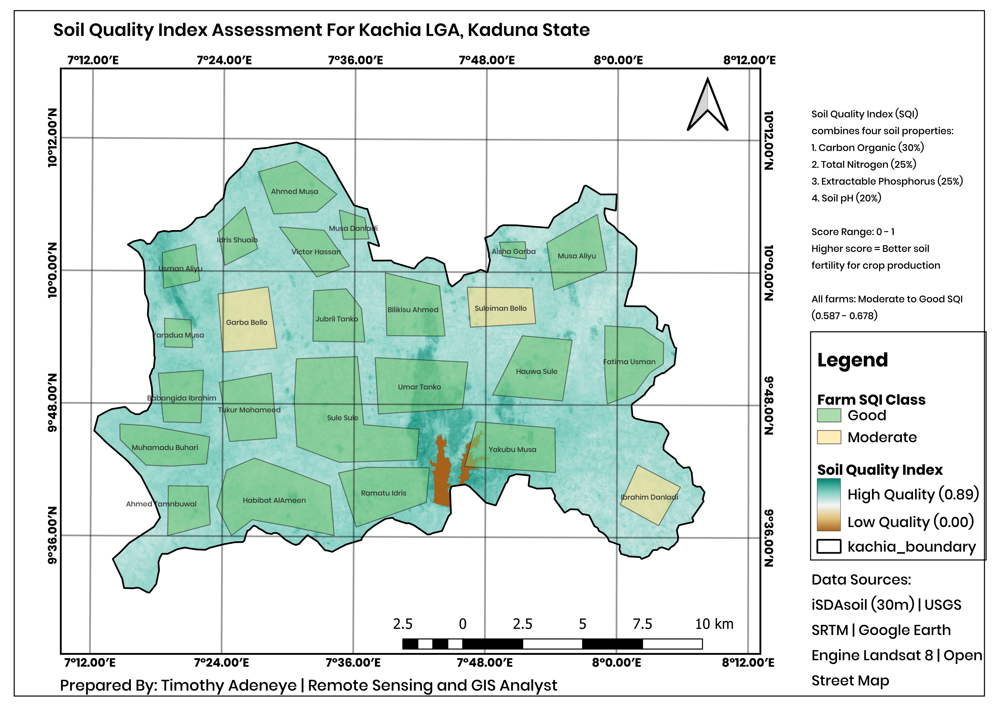

# 🌾 GIS-Based Enhanced Farm Viability Assessment
## Kachia LGA, Kaduna State, Nigeria

> A spatial analysis project assessing smallholder 
> farm viability to support agricultural loan 
> disbursement and farmer onboarding, modelled on 
> [ThriveAgric](https://thriveagric.com)'s farm 
> mapping workflow.

---


---

## 📌 Project Overview

This project uses GIS-based spatial analysis to 
assess the agricultural viability of 24 sample 
smallholder farms in Kachia LGA, Kaduna State, 
one of Nigeria's leading ginger producing zones. 
Eight environmental factors were combined into a 
single Farm Viability Score using weighted overlay 
analysis, with all data processed at 30m resolution.

---

## 🗺️ Maps

### Enhanced Farm Viability Score


### Factor Analysis


### Soil Quality Index


---

## 📊 Key Results

| Class | Farms | % | FAO | Recommendation |
|-------|-------|---|-----|----------------|
| High | 10 | 42% | S2 | Full loan disbursement |
| Medium | 12 | 50% | S2 | Standard conditions |
| Low | 2 | 8% | S2 | Field verification |

**All 24 farms = FAO S2 Moderately Suitable**

---

## 🔑 Key Findings

- Water proximity is the primary limiting factor
- Kachia is predominantly flat — ideal for farming
- Soil fertility is moderate — responds well to inputs
- SQI: 0.587–0.678 (Moderate to Good)
- pH 5.5–6.4 — ideal for ginger, maize, sorghum
- All farms within FAO S2 classification

---

## ⚙️ Methodology

All data processed in QGIS 3.40, EPSG:32632

### Suitability Factors & Weights

| Factor | Source | Weight |
|--------|--------|--------|
| Organic Carbon | iSDAsoil 30m | 20% |
| NDMI Moisture | GEE Landsat 8 | 15% |
| Nitrogen | iSDAsoil 30m | 15% |
| Soil Texture | iSDAsoil 30m | 15% |
| pH | iSDAsoil 30m | 10% |
| Slope | USGS SRTM | 10% |
| Water Distance | OpenStreetMap | 10% |
| Phosphorus | iSDAsoil 30m | 5% |

### Weighted Overlay Formula
```
Viability = (Carbon×0.20) + (NDMI×0.15) + 
(Nitrogen×0.15) + (Texture×0.15) + 
(pH×0.10) + (Slope×0.10) + 
(Water×0.10) + (Phosphorus×0.05)
```

### Soil Quality Index
```
SQI = (Carbon×0.30) + (Nitrogen×0.25) + 
      (Phosphorus×0.25) + (pH×0.20)
```

---

## 🛠️ Tools

| Tool | Purpose |
|------|---------|
| QGIS 3.40 | GIS analysis and map production |
| Google Earth Engine | Landsat 8 NDMI processing |
| iSDAsoil (30m) | African soil property data |
| GDAL Proximity | Water distance rasters |
| QGIS Zonal Statistics | Farm score extraction |
| Google Earth Pro | Farm digitizing |

---

## 📁 Repository Structure
```
├── Map1_FarmViability_V2.png
├── Map2_FarmClassification_V2.png  
├── Map3_FactorMaps_V2.png
├── Map4_SQI_V2.png
├── Farm_Viability_Results_V2.csv
├── Farm_Viability_Assessment_V2_Kachia.pdf
└── README.md
```

---

## 📂 Data Sources

| Dataset | Source |
|---------|--------|
| Soil Properties | [iSDAsoil](https://www.isda-africa.com/isdasoil/) |
| DEM/Slope | [USGS EarthExplorer](https://earthexplorer.usgs.gov/) |
| NDMI/Landsat | [Google Earth Engine](https://earthengine.google.com/) |
| Rivers/Water | [OpenStreetMap](https://www.openstreetmap.org/) |
| Farm Polygons | Google Earth Pro |

---

## 📄 Full Report

📥 [Download Full Report](Farm&Viability%Assessment%Kachia.pdf)

---

## 👤 Author

**Timothy Adeneye**  
Remote Sensing and GIS Analyst  
📍 Nigeria  
🔗 [GitHub](https://github.com/Bloom9ja)

---

*Methodology aligned with ThriveAgric's farm 
mapping and loan disbursement workflow.*
```
