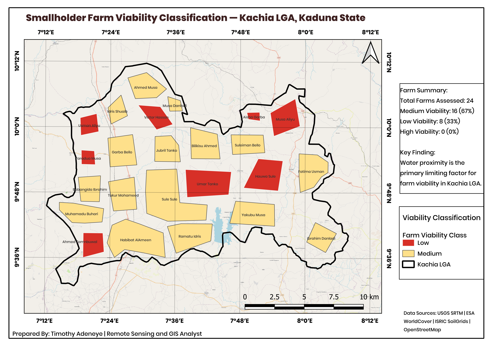
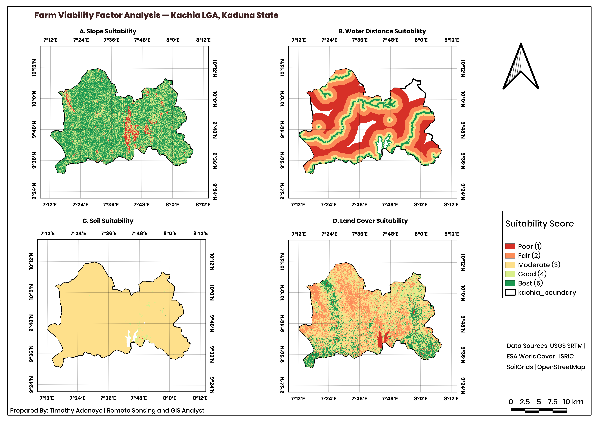

# 🌾 GIS-Based Farm Viability Assessment — Kachia LGA, Kaduna State

> A spatial analysis project assessing smallholder farm viability to support agricultural loan disbursement and farmer onboarding — modelled on [ThriveAgric](https://thriveagric.com)'s farm mapping workflow.

---



---

## 📌 Project Overview

This project uses GIS-based spatial analysis to assess the agricultural viability of 24 sample smallholder farms in **Kachia Local Government Area, Kaduna State, Nigeria**. Four environmental factors — soil texture, terrain slope, proximity to water, and land cover — were combined into a single **Farm Viability Score** for each farm.

The methodology directly mirrors ThriveAgric's farm mapping process, where soil texture, slope, and proximity to water are assessed before input financing and loan disbursement.

---

## 🗺️ Maps

### Farm Viability Score Map


### Factor Analysis Map


---

## 📊 Key Findings

| Viability Class | Farms | Percentage | Recommendation |
|----------------|-------|------------|----------------|
| High | 0 | 0% | — |
| Medium | 16 | 67% | Loan disbursement with standard conditions |
| Low | 8 | 33% | Field verification required |

- **Water proximity** is the primary limiting factor — most of Kachia LGA lies >5km from any river or waterbody
- **Slope is not a constraint** — Kachia is predominantly flat, well-suited for mechanised farming
- **Soil texture is moderately suitable** — Sandy Loam and Clay Loam dominate, requiring fertilizer inputs
- **Land cover is favourable** — predominance of cropland and grassland confirms active farming across the LGA

---

## ⚙️ Methodology

All data was processed in **QGIS 3.40** and reprojected to **WGS 1984 UTM Zone 32N (EPSG:32632)**.

### Suitability Factors & Weights

| Factor | Data Source | Weight |
|--------|-------------|--------|
| Soil Texture | ISRIC SoilGrids (AfSIS) | 35% |
| Slope | USGS SRTM (30m DEM) | 25% |
| Distance to Water | OpenStreetMap Rivers & Waterbodies | 25% |
| Land Cover | ESA WorldCover 2021 | 15% |

### Weighted Overlay Formula

```
Farm Viability Score = (Soil × 0.35) + (Slope × 0.25) + (Water × 0.25) + (Land Cover × 0.15)
```

### Workflow Summary

1. **Data Preparation** — Reprojection, clipping, format standardization
2. **Farm Digitizing** — 24 sample farm polygons digitized in Google Earth Pro
3. **Suitability Rasters** — Each factor reclassified to 1–5 score
4. **Proximity Analysis** — GDAL Proximity tool for river and waterbody distance
5. **Weighted Overlay** — Composite Farm Viability Score raster generated
6. **Farm Scoring** — Zonal Statistics extracted mean score per farm
7. **Map Production** — 3 professional maps produced in QGIS Print Layout

---

## 🛠️ Tools & Technologies


| Tool | Purpose |
|------|---------|
| QGIS 3.40 (Bratislava) | Primary GIS analysis and map production |
| GDAL Proximity | Euclidean distance raster generation |
| GDAL Rasterize | Vector to raster conversion |
| QGIS Raster Calculator | Weighted overlay computation |
| QGIS Zonal Statistics | Farm viability score extraction |
| Google Earth Pro | Farm polygon digitizing |

---

## 📁 Repository Structure

```
farm-viability-assessment-kachia/
│
├── Farm_Viability_Score.png          # Map 1 — Composite viability score raster
├── Sample_Farms_Viability_Map.png    # Map 2 — Farm classification map
├── Factor_Map.png                    # Map 3 — 4-panel factor analysis
├── Farm_Viability_Results.csv        # Farm attribute table with all scores
├── Farm_Viability_Assessment_ThriveAgric.pdf  # Full project write-up
└── README.md
```

---

## 📂 Data Sources

| Dataset | Source |
|---------|--------|
| SRTM Digital Elevation Model | [USGS EarthExplorer](https://earthexplorer.usgs.gov/) |
| Land Cover | [ESA WorldCover 2021](https://esa-worldcover.org/) |
| Soil Texture | [ISRIC SoilGrids](https://soilgrids.org/) |
| Rivers & Waterbodies | [OpenStreetMap](https://www.openstreetmap.org/) |
| Farm Polygons | Digitized — Google Earth Pro |

---

## 📄 Full Project Write-Up

For detailed methodology, results, and recommendations, download the full report:

📥 [Farm_Viability_Assessment_Kachia.pdf](Farm_Viability_Assessment_ThriveAgric.pdf)

---

## 👤 Author

**Timothy Adeneye**
Remote Sensing and GIS Analyst
📍 Nigeria
🔗 [GitHub](https://github.com/Bloom9ja)

---

*This project was developed as a portfolio piece demonstrating GIS-based agricultural suitability analysis aligned with ThriveAgric's farm mapping and loan disbursement workflow.*
